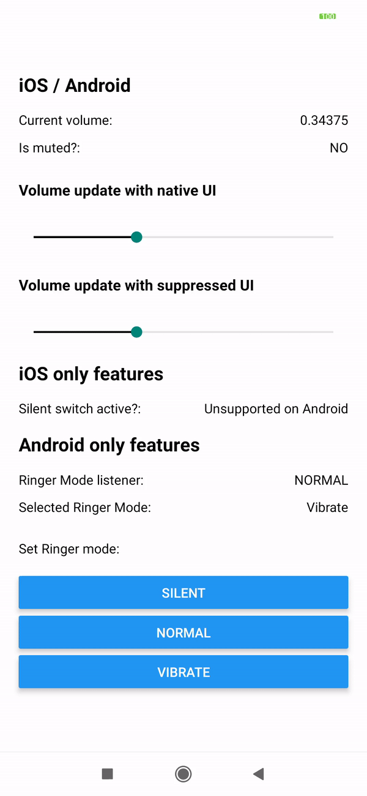

# react-native-volume-manager

This native package adds the ability to change the system volume on iOS and Android, listen to volume changes and suppress the native volume UI to build your own volume slider and UX. It also provides a simple API to get the current volume level. On iOS, you can check if the silent switch is enabled and listen to changes. On Android, you can set and listen for ringer mode changes.

|  |  |
| ----------------------------------------------- | --------------------------------------------------- |

## Notice

This library does **not work** in a **Simulator** or **Emulator**. It is only working on a real device.

## Installation

```sh
# Using npm
npm install react-native-volume-manager

# using yarn
yarn add react-native-volume-manager
```

#### Using React Native >= 0.60

Linking the package manually is not required anymore with [Autolinking](https://github.com/react-native-community/cli/blob/master/docs/autolinking.md).

## Expo

---

This library adds native code. It does not work with _Expo Go_ but you can easily install it using a [custom dev client](https://docs.expo.dev/development/getting-started/). Thats how it should be done in 2022 :).

**No config plugin required.**

---

## Usage 🚀

```tsx
import { VolumeManager } from 'react-native-volume-manager';

// ...

// set volume
await VolumeManager.setVolume(0.5); // float value between 0 and 1

// set volume with extra options
await VolumeManager.setVolume(0.5, {
  type: 'system', // defaults to "music" (Android only)
  showUI: true, // defaults to false, can surpress the native UI Volume Toast (iOS & Android)
  playSound: false, // defaults to false (Android only)
});

// get volume async, type defaults to "music" (Android only)
// iOS has only one type of Volume (system)
// see down below for more types
const { volume } = await VolumeManager.getVolume(type: 'music');

// or the oldschool way
VolumeManager.getVolume('music').then((result) => {
  console.log(result); // returns the current volume as a float (0-1)

  // NOTE: if you don't supply a type to getVolume on Android, you will receive the VolumeResult object:
  /*
  {
    volume: number, // these are the same
    music: number, // these are the same
    system: number, // these are the same
    ring: number,
    alarm: number,
    notification: number,
  }
  */
  // iOS will always return only the volume as float
});

// listen to volume changes
useEffect(() => {
  const volumeListener = VolumeManager.addVolumeListener((result) => {
    console.log(result.volume); // returns the current volume as a float (0-1)
    // on android, the result object will also have the keys music, system, ring, alarm, notification
  });

  // clean up function
  return function () {
    // remove listener, just call .remove on the volumeListener EventSubscription
    volumeListener.remove();
  }
}, []);

// or with useFocusEffect from react-navigation
useFocusEffect(
  React.useCallback(() => {
    const volumeListener = VolumeManager.addVolumeListener(async (result) => {
      if (Platform.OS === 'ios') {
        try {
          // once we detected a user on iOS triggered volume change,
          // we can change the audio mode to allow playback even when the
          // silent switch is activated.
          // This example requires expo-av
          await Audio.setAudioModeAsync({
            playsInSilentModeIOS: true,
          });
        } catch {}
      }
    });
    return function blur() {
      // remove listener, just call .remove on the emitter
      volumeListener.remove();
    };
  }, [])
);
```

## iOS mute switch listener

---

There is no native iOS API to detect if the mute switch is enabled/disabled on a device.

The general principle to check if the device is muted is to play a short sound without audio and detect the length it took to play. Has a trigger rate of 1 second.

**Note: The check is performed on the native main thread, not the JS thread.**
You can increase or decrease how often the check is performed by changing the `VolumeManager.setNativeSilenceCheckInterval(1)` property. Minimum value is `0.5`, default is `2`. The default value is usually enough.

```tsx
import { VolumeManager } from 'react-native-volume-manager';
const [isSilent, setIsSilent] = useState<boolean>();

VolumeManager.setNativeSilenceCheckInterval(1); // min 0.5, default 2

// ....
// ....

useEffect(() => {
  const silentListener = VolumeManager.addSilentListener((status) => {
    setIsSilent(status); // status is a boolean
  });

  return () => {
    // remove listener, just call .remove on the emitter
    // never forget to clean up
    silentListener.remove();
  };
}, []);
```

## API

| Method                                                  | Description                                                                                                                                                                                                                                                                                                                                                                                                                                                                               |
| ------------------------------------------------------- | ----------------------------------------------------------------------------------------------------------------------------------------------------------------------------------------------------------------------------------------------------------------------------------------------------------------------------------------------------------------------------------------------------------------------------------------------------------------------------------------- |
| **Volume**                                              |
| getVolume(type?:string) => Promise                      | Get the system volume. <br><br>`type` must be one of `music`, `call`, `system`, `ring`, `alarm`, `notification`, default is `music`. (Android only, iOS will always report the system volume)                                                                                                                                                                                                                                                                                             |
| setVolume(value:float, config?:object)                  | Set the system volume by specified value, from 0 to 1. 0 for mute, and 1 for the max volume.<br><br> `config` can be `{type: 'music', playSound:true, showUI:true}`<br><br> `type` : must be one of `music`, `call`, `system`, `ring`, `alarm`, `notification`, default is `music`. (Android only) <br>`playSound`: Whether to play a sound when changing the volume, default is `false` (Android only)<br>`showUI`: Show the native system volume UI, default is `false` (Android & iOS) |
| addVolumeListener(callback)                             | Listen to volume changes (soft- and hardware. addListener will return the listener which is needed for cleanup. Result passed to callback contains `volume` as key.                                                                                                                                                                                                                                                                                                                       |
| `listener.remove()`                                     | Remove the listener when you don't need it anymore. Store the return of `const listener = VolumeManager.addListener()` in a variable and call it with `.remove()`. See the example above.                                                                                                                                                                                                                                                                                                 |
| addRingerListener(callback): RingerSilentStatus => void | **Android only:** Listen to ringer mode changes. Returns object with type `RingerSilentStatus`                                                                                                                                                                                                                                                                                                                                                                                            |
| removeRingerListener(listener) => void                  | **Android only:** Unlike `addVolumeListener`, you need to call a separate method and pass the return of `addRingerListener`.                                                                                                                                                                                                                                                                                                                                                              |

## Contributing

See the [contributing guide](CONTRIBUTING.md) to learn how to contribute to the repository and the development workflow.

## Special thanks

- Uses code from https://github.com/c19354837/react-native-system-setting
- Uses code from https://github.com/vitorverasm/react-native-silent
- Uses code from https://github.com/GeorgyMishin/react-native-silent-listener

I used these libraries to make this library work on Android and iOS and to have a unified library which does everything related to Volume.

## License

MIT
